# Gaming & Mental Health — Análise Exploratória de Dados

Análise exploratória de dados (EDA) sobre a relação entre tempo de jogo, saúde mental, sono e impactos na vida real, com foco em identificar padrões de comportamento e possíveis riscos associados ao uso excessivo de jogos.

## Contexto de Negócio

- O uso de jogos eletrônicos cresce globalmente, mas seus impactos na saúde mental e na qualidade de vida ainda são pouco compreendidos de forma quantitativa
- Profissionais de saúde, pesquisadores e plataformas de jogos carecem de análises baseadas em dados para identificar padrões de risco e estabelecer limites de uso saudável
- Sem uma visão clara sobre quais comportamentos estão associados ao vício e ao declínio da saúde mental, é difícil desenvolver intervenções eficazes

## Objetivo do Projeto

- Mais horas de jogo estão associadas a pior saúde mental?
- Existe um “limite seguro” de horas jogadas por dia?
- O sono atua como variável mediadora da saúde mental?
- O comportamento de jogo impacta estudo e trabalho?
- Quais fatores estão mais associados ao risco de vício?

## Dataset

Fonte: Kaggle 
Tema: Gaming and Mental Health 
Dados incluem: 

- Tempo diário de jogo
- Qualidade e horas de sono
- Estado emocional
- Isolamento social
- Produtividade e desempenho acadêmico
- Indicadores de dependência em jogos

## Ferramentas Utilizadas

- Python, Pandas, NumPy, Matplotlib, Seaborn
- Análise Exploratória de Dados
- Engenharia de features (faixas de horas, variáveis derivadas)

## Tratamento de Dados

- Preenchimento de valores nulos com mediana:

grades_gpa
work_productivity_score

- Padronização e tradução de categorias (ex: humor, qualidade do sono)

- Criação de variáveis derivadas:

Faixas de horas jogadas (faixa_horas)
Tradução de variáveis booleanas

## Análises Realizadas

### 1. Distribuições

- **Distribuição de tempo de jogo**

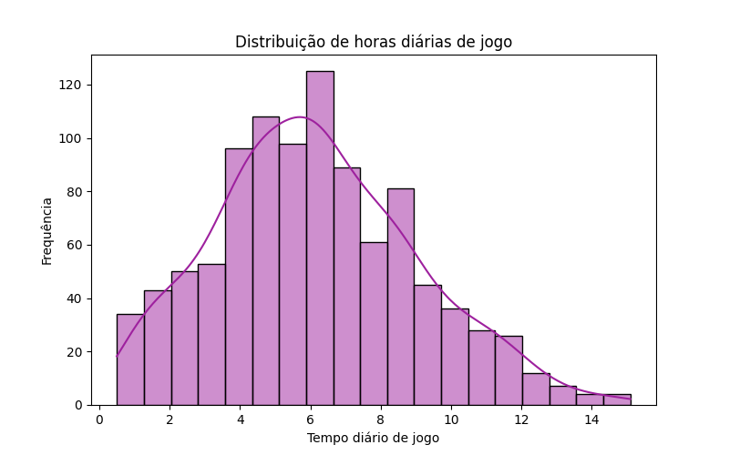

> A maior parte dos jogadores, joga de 4 a 8 horas por dia, com uma média total de 6 horas diárias. Há jogadores que chegam a passar 15h+ jogando.

- **Distribuição de tempo de sono**

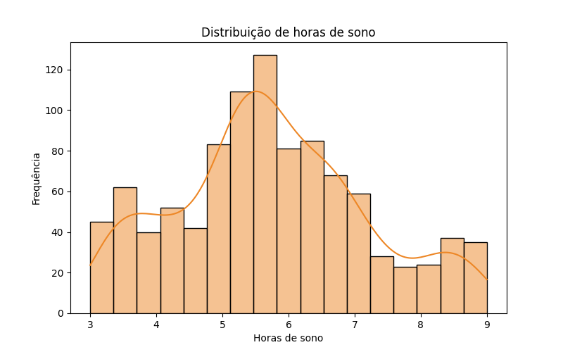

> A distribuição de sono mostra que a maior parte dos jogadores dorme menos de 7 horas por noite. O terceiro quartil (75%) está em aproximadamente 6,6 horas, indicando que apenas uma pequena parcela atinge níveis mais elevados de descanso.

- **Distribuição de gênero**

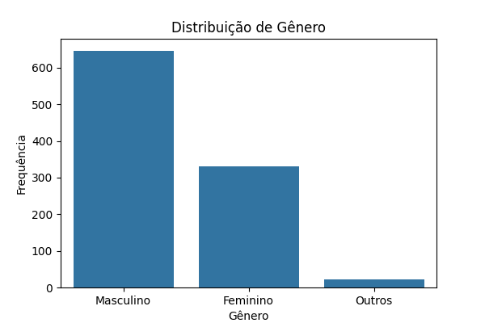

> A maior parte dos jogadores do conjunto de dados pertence ao sexo masculino, já pessoas do gênero feminino passam dos 30%.

---

### 2. Tempo de jogo vs Saúde Mental

- **Humor x Horas diárias de jogo**

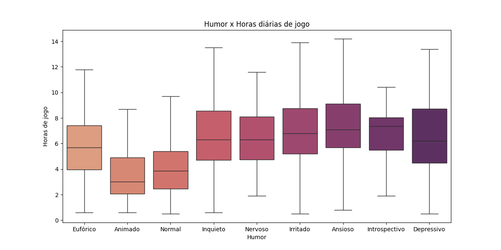

> Um maior número de horas jogadas está associado a sentimentos de irritação, ansiedade, introspecção e depressão.

- **Mudança de humor x Horas diárias de jogo**

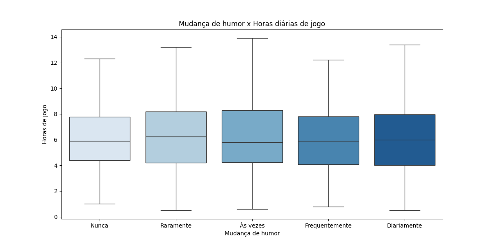

> Não há indícios de que mais horas diárias de jogo inluenciem mudanças de humor. Os grupos são estatisticamente muito parecidos e a variação de humor acontece de forma similar tanto para quem joga pouco quanto para quem joga muito.

- **Score de isolamento social x Horas diárias de jogo**

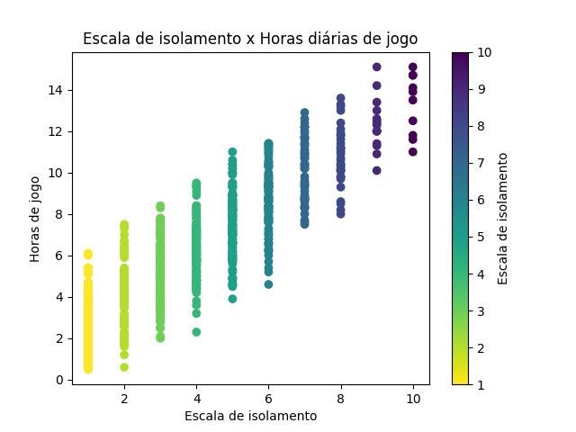

> Observa-se uma correlação positiva entre o tempo de jogo diário e o nível de isolamento social. Notavelmente, indivíduos com uma carga horária superior a 14 horas diárias apresentam os índices mais elevados na escala, atingindo o teto de 10 pontos.

- **Sintomas de abstinência x Média de horas diárias de jogo**

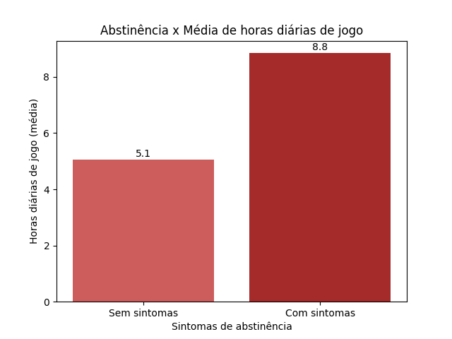

> O grupo que dedica 8 horas ou mais por dia aos jogos apresenta uma correlação direta com o surgimento de sintomas de abstinência.

---

### 3. Limite de horas jogadas

- **Média de isolamento social por faixa de horas jogadas**

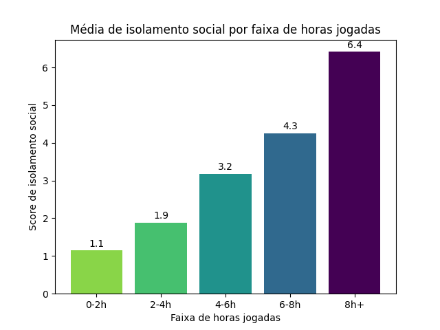

> O isolamento social é mais evidente entre jogadores que dedicam em média 8 horas ou mais ao jogo diariamente, com esses indivíduos alcançando a marca de 6,4 pontos na escala de isolamento de 1 a 10.

- **Horas de jogo x Qualidade do sono**

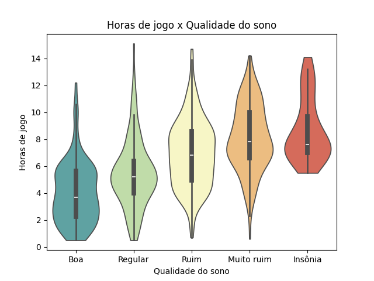

> Os dados revelam que o tempo de jogo é um fator determinante na higiene do sono. Enquanto indivíduos com 'Boa' qualidade de sono concentram-se abaixo das 4 horas diárias, aqueles que relatam 'Insônia' apresentam uma mediana de aproximadamente 8 horas de jogo, com uma densidade mínima de casos abaixo de 6 horas diárias."

---

### 4. Sono como variável mediadora

- **Horas de sono x Humor**

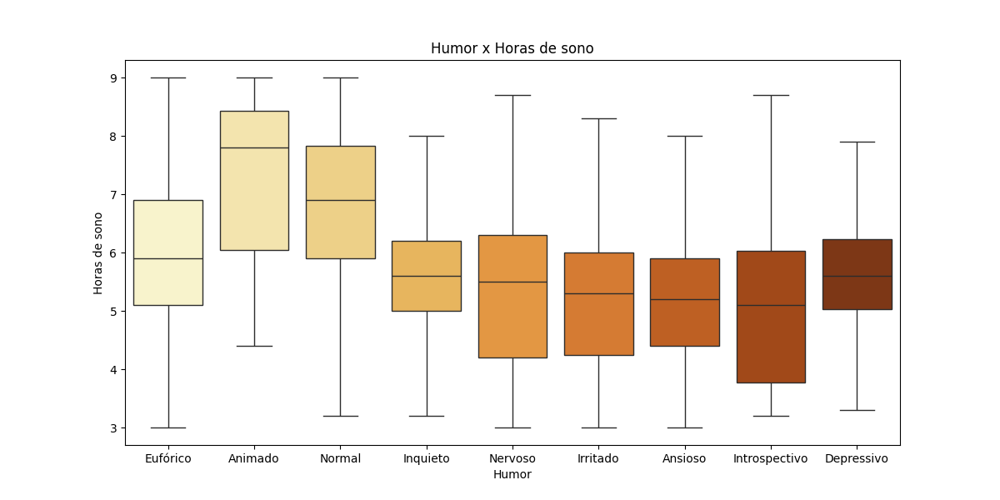

> Os dados demonstram uma correlação direta entre a privação de sono e estados emocionais negativos. Enquanto indivíduos que dormem em média 8 horas relatam estados de ânimo positivos (Animado), aqueles com restrição de sono para a faixa de 5 horas apresentam maior incidência de sintomas de ansiedade, irritabilidade e nervosismo."

- **Qualidade de sono x Score de isolamento social**

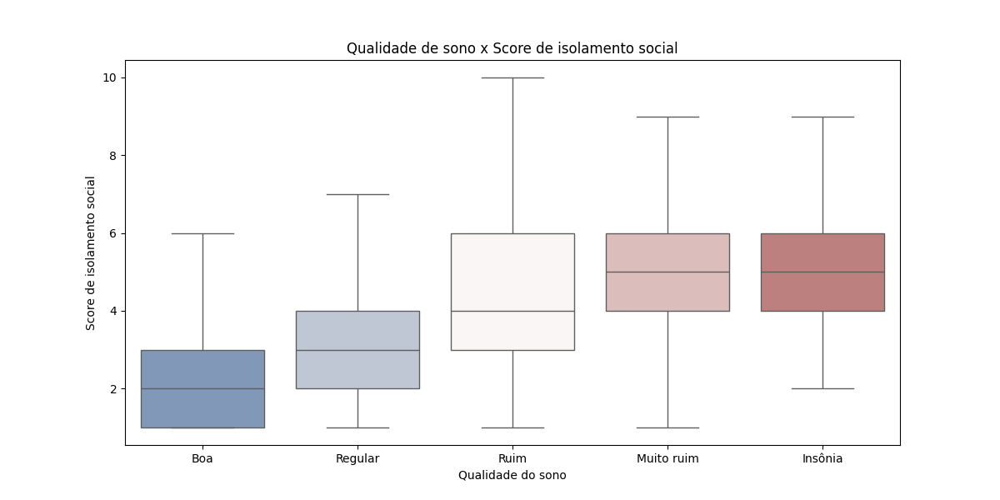

> Observa-se uma correlação positiva entre distúrbios severos do sono e o distanciamento social. Indivíduos diagnosticados com insônia ou qualidade de sono 'muito ruim' apresentam, invariavelmente, os índices mais elevados na escala de isolamento.

---

### 5. Impacto na vida real

- **Desempenho acadêmico x Horas de jogo**

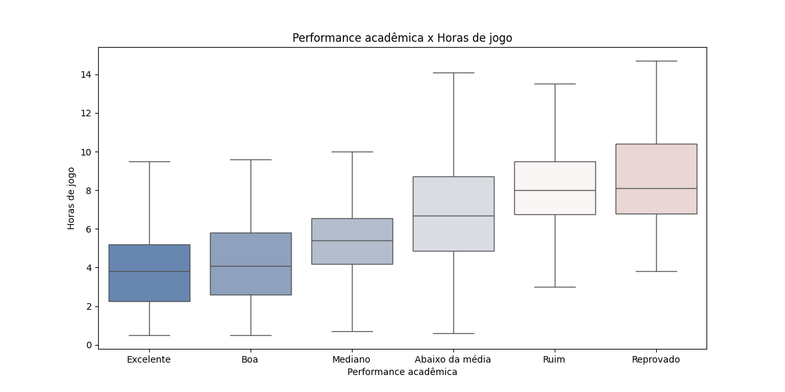

> Alunos reprovados jogam, em média, o dobro do tempo (8h) do que alunos com desempenho excelente (4h). Além disso, o teto de horas jogadas por alunos com notas altas raramente ultrapassa a marca das 10 horas, enquanto nos grupos de baixo rendimento esse valor chega a 14h+.

---

### 6. Risco de vício em jogos

- **Horas jogadas e risco de vício**

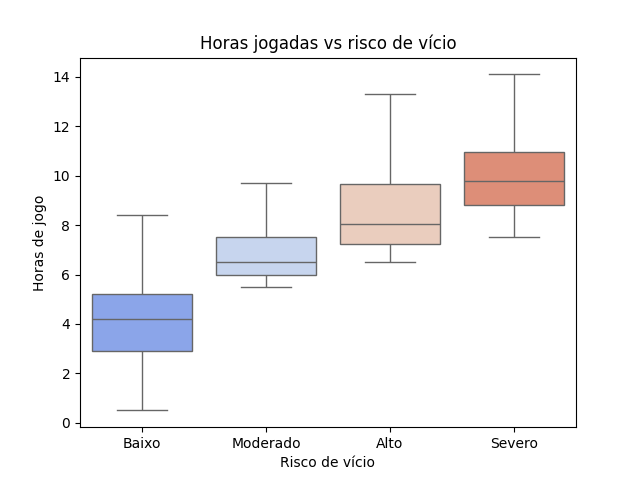

> Existe uma relação direta e progressiva entre o tempo de exposição aos jogos e o agravamento do risco de vício.

- **Risco de vício x comportamento de continuidade**

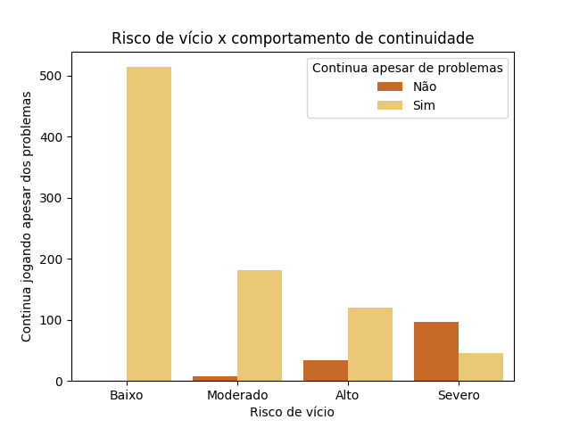

> O gráfico mostra que jogadores de Baixo Risco jogam sem problemas, por isso continuam. Já no Risco Severo, há um aumento expressivo de quem não continua jogando, indicando que esses indivíduos reconhecem os danos e tentam interromper o hábito.

- **Comparação entre médias**

> O grupo de Risco Severo apresenta o dobro de horas de jogo (10h) e cinco vezes mais gastos financeiros que o grupo de baixo risco. O isolamento social acompanha essa escalada, atingindo seu ápice (6.5) junto com a dependência extrema.

---

### 7. Correlação entre variáveis

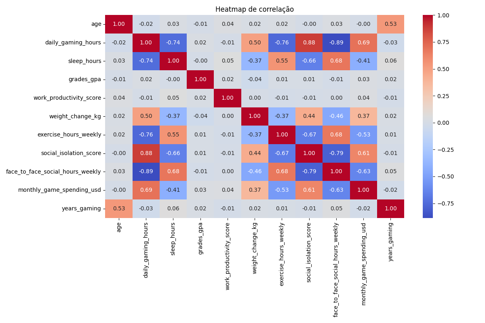

### Correlações mais relevantes

| Variáveis | Correlação |
|---|---|
| Horas de jogo × Isolamento social | +0,88 |
| Horas de jogo × Interação social presencial | −0,89 |
| Horas de jogo × Exercícios físicos | −0,76 |
| Horas de jogo × Horas de sono | −0,74 |
| Horas de jogo × Gastos mensais | +0,69 |
| Horas de jogo × Mudança de peso | +0,50 |

---

### 8.Conclusão das análises

- 🎮 Tempo de jogo é o fator central que impacta saúde, sono e vida social
- ⏱️ 8h/dia é o ponto crítico onde os problemas aumentam significativamente
- 😴 Mais jogo = pior qualidade de sono (forte correlação negativa)
- 🧠 Privação de sono aumenta ansiedade, irritação e depressão
- 🎓 Alunos com pior desempenho jogam cerca do dobro do tempo
- 👥 Mais horas jogando = maior isolamento social (correlação alta)
- 💸 Jogadores mais viciados gastam muito mais dinheiro (até 5x)
- ⚖️ Até 4–6h/dia tende a ser um uso equilibrado, sem grandes prejuízos
- 🚨 Acima de 8h/dia há queda geral na qualidade de vida

---

## Autora

Maria Alice Rocha 
Jornalista e pós graduada em Analytics e Business Intelligence 
Foco em análise de dados, storytelling, ciência de dados e insights acionáveis 
